## {#title-slide .title-slide .quarto-title-block .center data-menu-title="Title"}

::: {.center-x}
{height="180px"} &nbsp;&nbsp;&nbsp; {height="300px"} &nbsp;&nbsp;&nbsp; {height="180px"}
:::

<h1 class="title">The NASA Earthdata Cloud Cookbook</h1>

A Quarto Collaboration Story

Andy Teucher, Openscapes

## {background-image="img/nasa-space-collage.png" data-menu-title="NASA collage" background-size="cover"}

::: notes
- When you first think of NASA, you probably think of space, and rockets and moon rovers
- Incredible, amazing, awe inspiring
:::

## {.center background-image="img/earth-from-space.png" data-menu-title="Earth from space"}

::: notes
- What I now think of when I think of NASA \- is:
- looking back at Earth
- using satellites to capture incredible data with different instruments so we can learn about our world
:::

# 100+ petabytes of data

::: notes
- NASA's Earth Science program manages over 100 petabytes of remote sensing data
:::

## {.center data-menu-title="EO data"}

::: {.columns}
::::: {.column width="40%"}
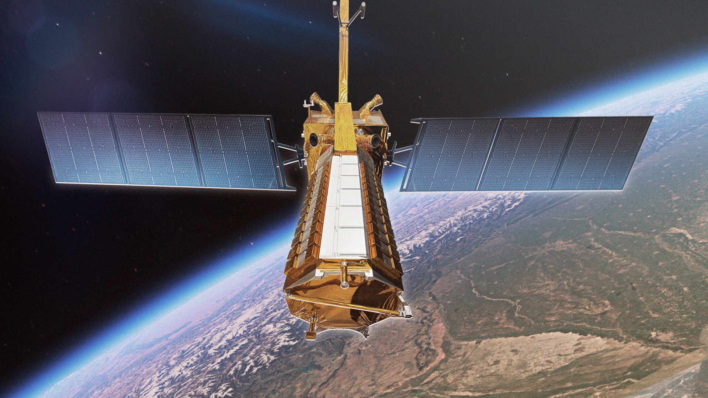{.absolute .no-radius width=882.7px height=522.9px left=-179.3px top=160.6px style="transform: rotate(90deg);"}
:::::

::::: {.column width="60%"}
::::::: daacs
{.no-radius width="1100px"}

{.no-radius width="1100px"}

{.no-radius width="1100px"}
:::::::
:::::
:::

::: notes
- contributes to scientific research all over the world,
- helping us learn about climate change and its impacts, landscape and ocean biology, and water and atmospheric processes.
- Really important things for the future of the world
- Scientists need to get it, understand it, use it
- Getting this data into the hands of scientists is a complicated task that is the primary responsibility of NASA staff across 11 different data centres.
:::

## {.center background-image="img/mentors.png" data-menu-title="Mentors" visibility="hidden"}

##

::: {.center-x}
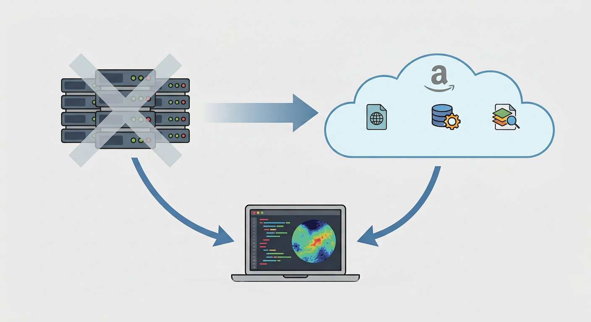
:::

::: notes
- This task has changed over the last few years
- Like so many organisations, moved data from on-premesis servers to the cloud
- Many advantages
- Access patterns to the data have changed
- Important that researchers can still easily access the data
- Data centre staff have been challenged to both learn and teach new and more efficient ways of accessing and working with cloud-based satellite data.
:::

##

{width="70%"}

::: footer
<https://nasa-openscapes.github.io/earthdata-cloud-cookbook>
:::

::: notes
- So today, I'm gonna tell you all about the Earth Data Cloud Cookbook
- Important platform for communicating best practices for working NASA Earth Science data in the cloud
- Talk about how this was made possible through Quarto
- Quarto is the scaffolding - help meet needs of users and contributors
- also about the community at NASA, and the collaboration that makes the work they do possible
:::

## {.center background-image="img/openscapes.png" data-menu-title="Openscapes" background-size="contain"}

::: footer
Artwork by [Allison Horst](https://www.allisonhorst.com/)
:::

::: notes
- Don't work for NASA directly
- Openscapes, an organization that helps scientists do open, collaborative, and inclusive data-intensive science
:::

## Technical & Social Infrastructure Together

{.absolute height=220px left=1339px top=-36px}

{.absolute height=598px left=70px top=231.7px}

::: notes
- Provide structures for technical skill-building, efficient teamwork, and collaborative community development
- Openscapes image: tooling \+ people.
  These are not disparate things.
  Openscapes provides scaffolding and space and facilitation
:::

## NASA Openscapes Mentors

::: columns
::::: {.column width="40%" .center-x}
{width="40%"} {width="30%"}

:::::

::::: {.column width="60%"}
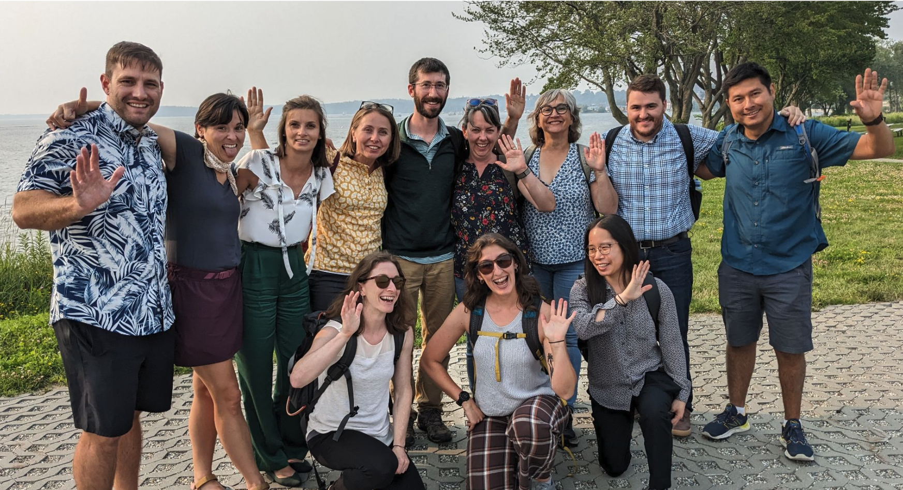{width="100%"}
:::::
:::

::: notes
- Working with NASA since 2021 to support Earth Science Data Center staff in their migration to the cloud
- Data Center staff teach workshops on cloud data access, and from these produce amazing tutorials
- for teaching scientists modern data science workflows
- combining best practices for cloud data access, analysis, and scientific context
- a critical resource for users, BUT
- Data Centers were doing this in silos
  - duplicated effort
  - Not learning from each other
- Openscapes has been working with mentors to build a framework for them to collaborate to create learning resources for their teams and communities.
:::

## This may sound familiar...

::: fragment
{.absolute height=777px left=-83.6px top=130px}

{.absolute width=800px left=860px top=-19px}
:::

::: notes
- Julie Lowndes - founder and lead of Openscapes
- keynoted the global launch of quarto with Mine Cetinkaya-Rundel.
- based on the work she and NASA Mentors had done with JJ Allaire.
- Julie and the Mentors were the first external users of Quarto, and had spent hours in Zoom rooms during Covid screensharing with JJ and the nascent Quarto team
:::

## The Earthdata Cloud Cookbook {.center .v-center}

::: columns
::::: {.column width="75%"}

:::::

::::: {.column width="25%" .center}

:::::
:::

::: footer
<https://nasa-openscapes.github.io/earthdata-cloud-cookbook>
:::

::: notes
- Quarto Website
- Published with GitHub pages
- Brings together documentation + Python and R tutorials
- Users are varied in their needs and scientific and technical backgrounds
- Structure: tried to follow a framework to separate different types of content
- Help users find what they need, and help contributors know where to put new content
:::

## Explanation {.center}

::: columns
::::: {.column width="75%"}
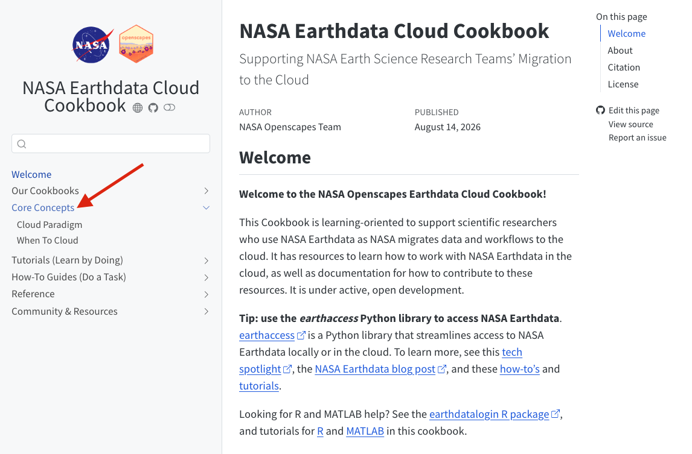
:::::

::::: {.column width="25%" .center}

:::::
:::

::: footer
<https://nasa-openscapes.github.io/earthdata-cloud-cookbook>
:::

::: notes
- Explanation: Core concepts, background, and other information
:::

## Tutorials {.center}

::: columns
::::: {.column width="75%"}
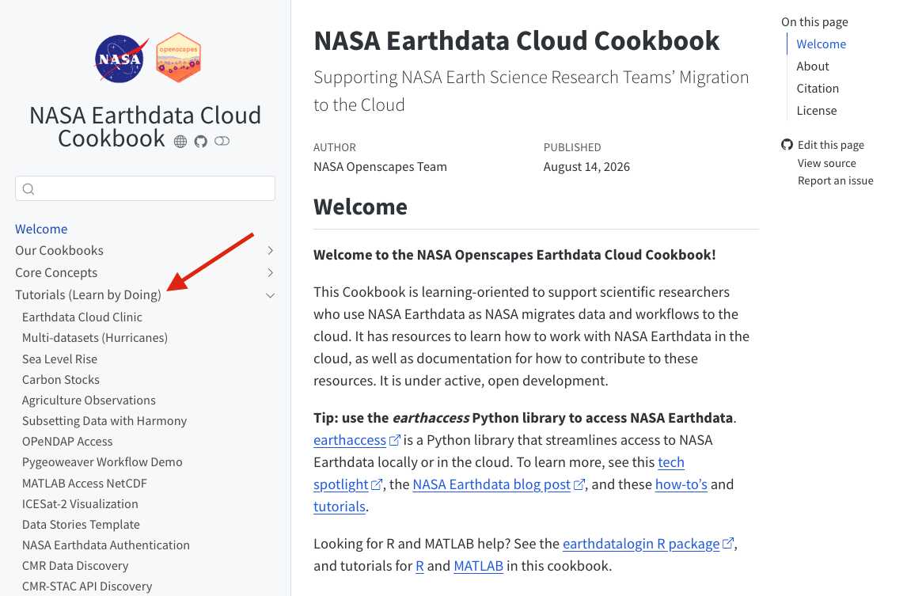
:::::

::::: {.column width="25%" .center}

:::::
:::

::: footer
<https://nasa-openscapes.github.io/earthdata-cloud-cookbook>
:::

::: notes
- Tutorial: longer, more in-depth, with scientific context
:::

## How-To {.center}

::: columns
::::: {.column width="75%"}
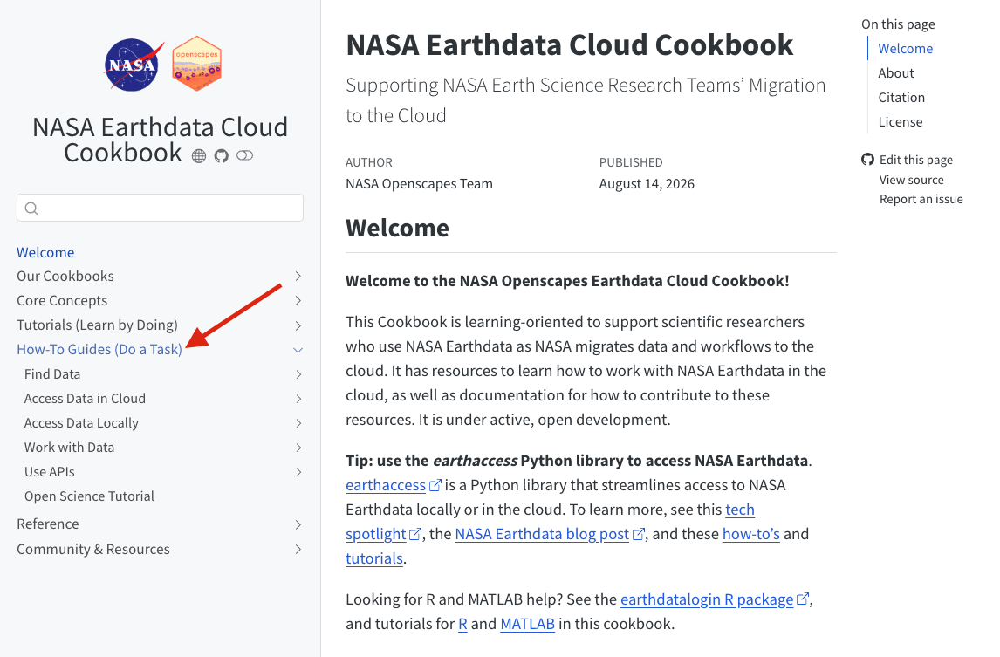
:::::

::::: {.column width="25%" .center}

:::::
:::

::: footer
<https://nasa-openscapes.github.io/earthdata-cloud-cookbook>
:::

::: notes
- How-To: short, focused, task-oriented
- Youtube to fix dishwasher
:::

## Reference {.center}

::: columns
::::: {.column width="75%"}
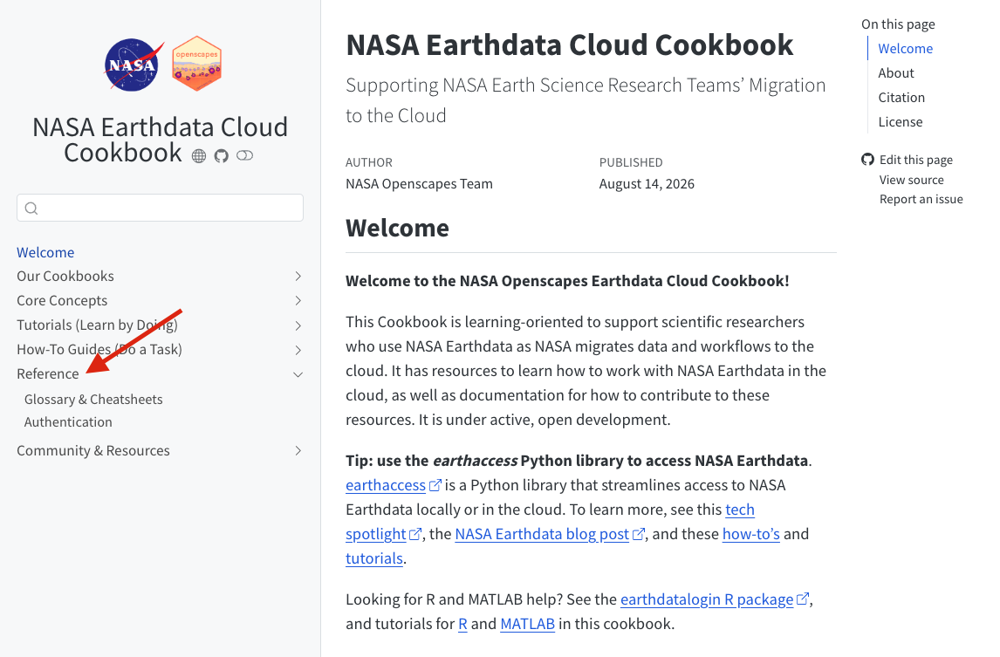
:::::

::::: {.column width="25%" .center}

:::::
:::

::: footer
<https://nasa-openscapes.github.io/earthdata-cloud-cookbook>
:::

::: notes
- Reference: Other technical reference material, links to other sources
:::

##

::: {.columns}
::::: {.column}
### How-To

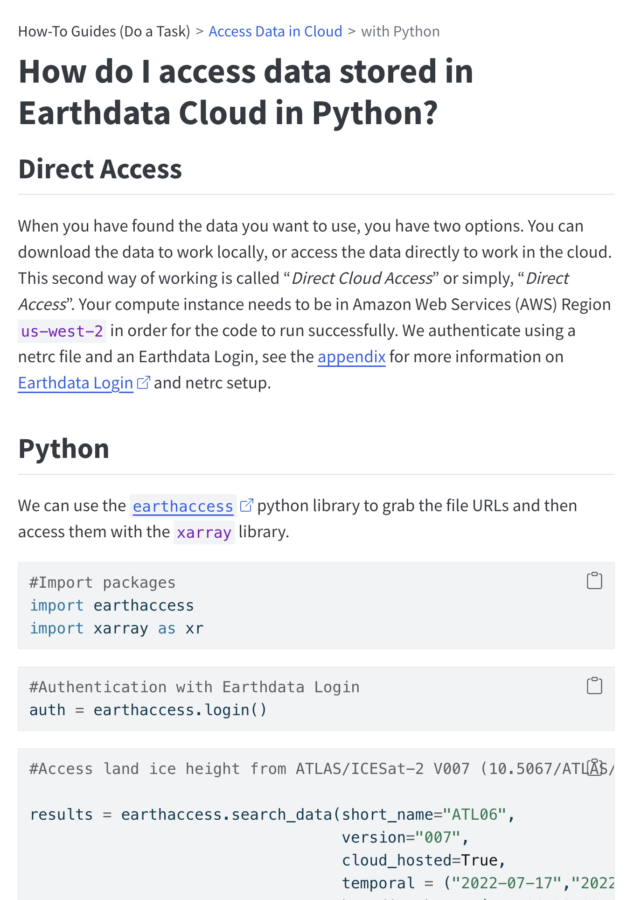
:::::

::::: {.column}
### Tutorial

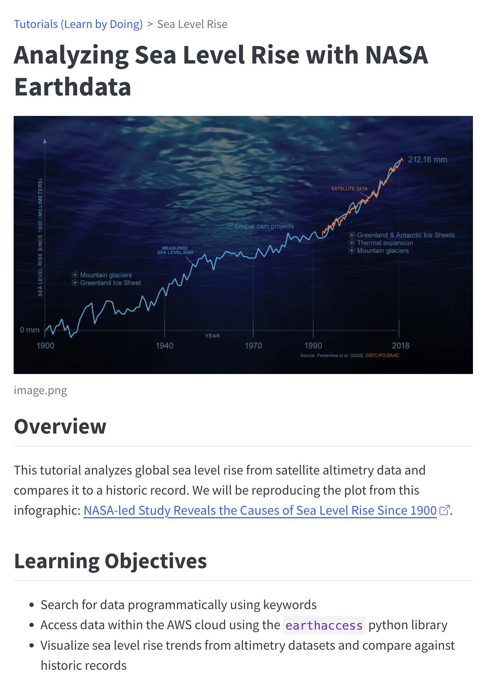
:::::
:::

::: notes
- core content are the tutorials and how-tos
:::

## Why Quarto?

### Considerations {.color-white}

::: {.columns}
::::: {.column width="60%"}
::::::: {.fragment}
- [**Contributors**]{.color-gold} use R and Python
:::::::
::::::: {.fragment}
- [**Users**]{.color-gold} use R and Python
:::::::
::::::: {.fragment}
- [**Jupyter Notebooks**]{.color-gold} are cumbersome
:::::::
::::::: {.fragment}
- People [**love**]{.color-gold} Jupyter Notebooks
:::::::
::::::: {.fragment}
- Contributors are [**scientists**]{.color-gold}, not all are software engineers
:::::::
:::::

::::: {.column width="40%"}
:::::
:::

## Why Quarto?

::: {.columns}
::::: {.column width="60%"}
### Considerations {.color-white}

::::::: {.fragment .custom .check-green fragment-index=1}
- [**Contributors**]{.color-gold} use R and Python
:::::::
::::::: {.fragment .custom .check-green fragment-index=1}
- [**Users**]{.color-gold} use R and Python
:::::::
::::::: {.fragment .custom .check-green fragment-index=2}
- [**Jupyter Notebooks**]{.color-gold} are cumbersome
:::::::
::::::: {.fragment .custom .check-green fragment-index=3}
- People [**love**]{.color-gold} Jupyter Notebooks
:::::::
::::::: {.fragment .custom .check-green fragment-index=4}
- Contributors are [**scientists**]{.color-gold}, not all are software engineers
:::::::
:::::

::::: {.column width="40%"}
###  {margin-bottom="0"}

::::::: {.fragment fragment-index=1}
- Multilingual: [R + Python]{.color-gold}
:::::::

::::::: {.fragment fragment-index=2}
- `.qmd` file format
:::::::

::::::: {.fragment fragment-index=3}
- Multi-format input and output (`.ipynb`)
:::::::

::::::: {.fragment fragment-index=4}
- Publishing tools
  - GitHub pages
  - `quarto freeze`
:::::::
:::::
:::

::: notes
- Multilingual \-
  - Meet contributors where they are and meet needs of diverse users
  - Contribute via ipynb or qmd, Python or R
  - Standardized format look/feel
  - Why this is important \- specific examples from the cookbook that other people may be able to relate to.
- Quarto file format
  - Contributors seeing benefits over ipynb (slowly) \+1
  - Plain text file (?)
    easy to version control (difficult with ipynb)
- Multi-format download (ipynb) (people like notebooks)
  - Options to render to html-pdf-etc
- Publishing tools
  - GitHub pages
  - Freeze
    - Don't need to execute whole book
:::

## {visibility="hidden" data-menu-title="jupyter format"}

# Collaborative coworking is a force multiplier

::: notes
- We are in a Quarto session, and I want to emphasize how critical Quarto has been
- But I also want to make sure to center the Mentors at NASA, and their passion, expertise, and leadership.
- Talk about the collaborative coworking that has been a critical part of the success of the cookbook, and all of the other work mentors are doing to support their teams and communities.
:::

## What is coworking?

::: {.columns}
::::: {.column width="60%" .v-center}
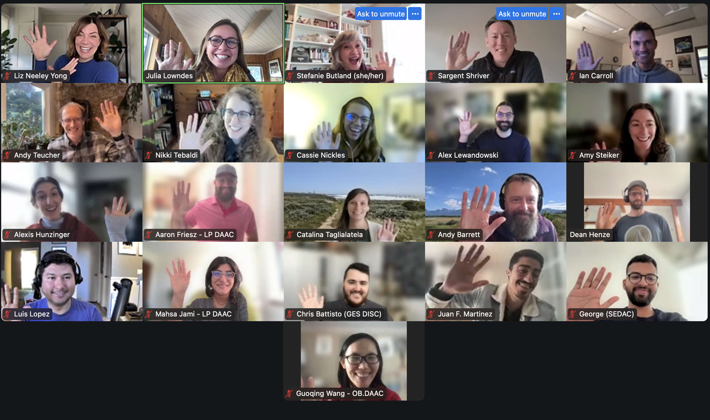
:::::

::::: {.column width="40%"}
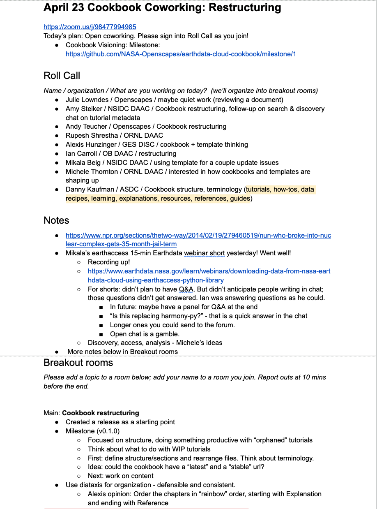
:::::
:::

::: notes
- Biweekly hour and a half session, on Zoom, with NASA Mentors
- Openscapes provides scaffolding by scheduling, creating shared notes docs
- come together to work on the cookbook
- I lead these sessions, looking out for what they need
- Discuss what needs to be done / what we want to work on
- Match up expertise / interest with needs
- Breakout rooms to get things done
- Design and create new content
- Create issues, Review PRs
- Onboard new contributors
- Screenshare to get feedback or solve a problem together.
- Seeing how other people work is a big part of transition to working more openly and collaboratively.
- We (Openscapes) put time into the quarto scaffolding side, maintenance...
- Having a tool that doesn't require too much effort to use/learn if you have a different technical background makes coworking easier
:::

# {.heading-logo height=2em} ❤️ {.heading-logo height=2em} # {data-menu-title="NASA loves Quarto"}

## Quarto is helping spread open practices across NASA

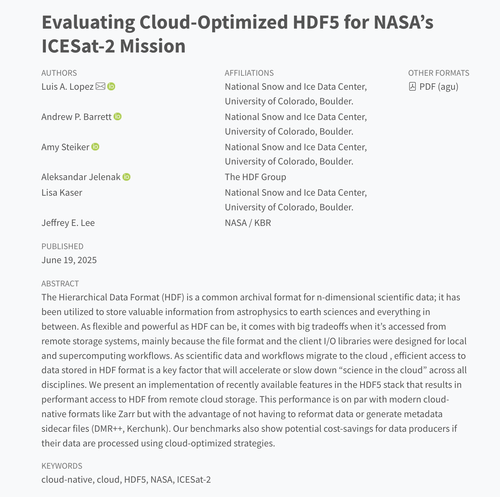{.fragment .absolute width=527px left=-60px top=120px}

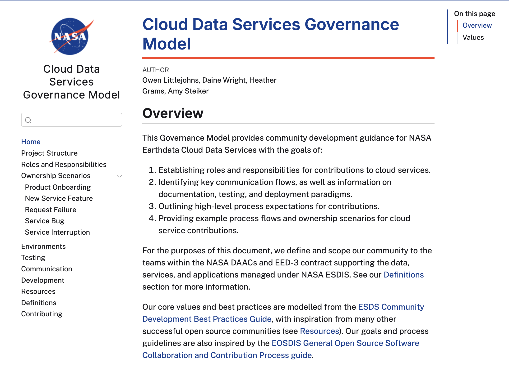{.fragment .absolute width=560px left=510px top=500px}

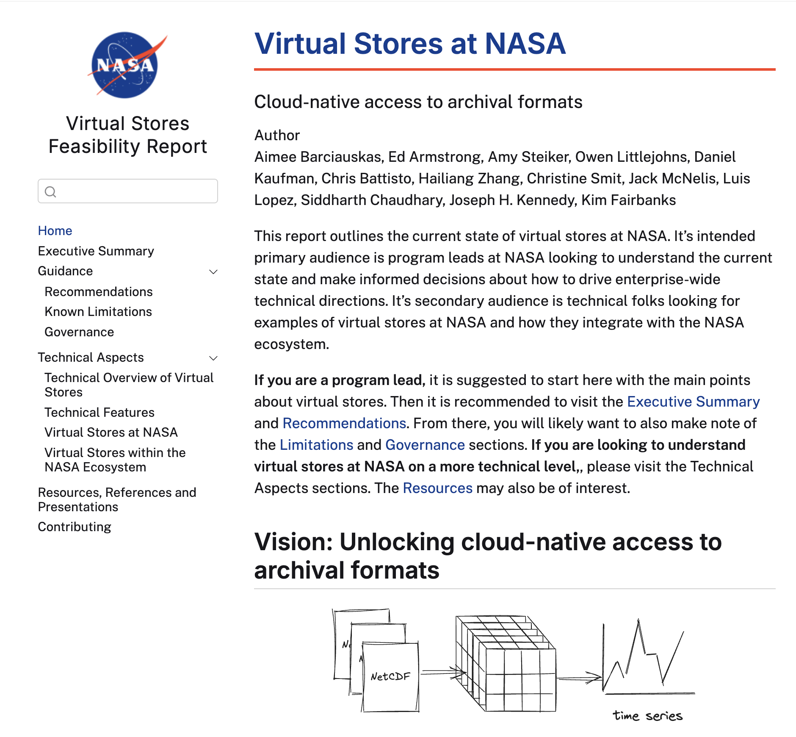{.fragment .absolute width=542px left=1115px top=120px}

::: notes
- use of quarto across NASA
- manuscript preprints
- governance documents
- technical documentation
- other cookbook like sites - cookbook "network"
- helping fuel a shift to open documentation and sharing early.
:::

--------------------------------------------------------------------------------

::: {.columns}
::::: {.column width="75%"}
::::::: {.fancy-quote}
"Before Openscapes and Quarto, I was hesitant to put unfinished tutorials ... on a public platform, but I've really come to appreciate this new open way of collaborating and developing in a way that [**lets others learn and scale up our efforts**]{.color-gold}.
I see Quarto as [**a tool that enables us**]{.color-gold} to open up and share our process and artifacts in a way that is friendly to the broader data user community."
:::::::
:::::

::::: {.column width="2%"}
:::::

::::: {.column width="23%"}
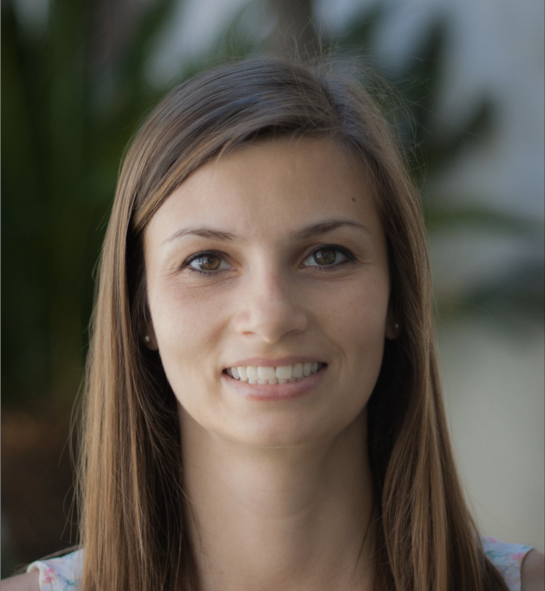
:::::
:::

::: {.fancy-quote}
**- Catalina Oaida Taglialatela**
:::

::: notes
- TAG-LEE-AH LA-TELL-AH
- This has really led NASA to work more openly.
- Pushed ourselves.
- We're learning together, opening.
- Contribution/onboarding section is part of the book, not "frontstage/backstage"
:::

--------------------------------------------------------------------------------

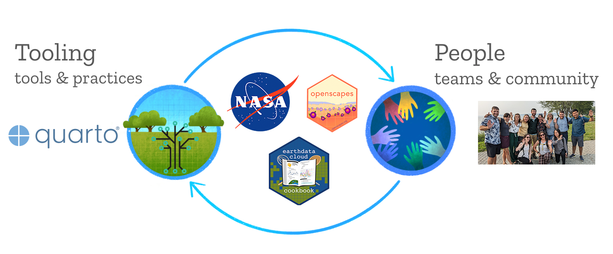

::: notes
- Story of Tools \+ People
- Combination of:
  - Dedicated people (NASA Mentors)
  - strong community structures and open practices (Openscapes)
  - open, easy to use tools (Quarto)
- Build things like the Earthdata Cloud Cookbook
- Ultimately helps to power the science that's critical for us to learn more about our world and what we can do to help make it better.
:::
