## {#title-slide .title-slide .quarto-title-block .center data-menu-title="Title"}

::: {.center-x}
{height="180px"} &nbsp;&nbsp;&nbsp; {height="300px"} &nbsp;&nbsp;&nbsp; 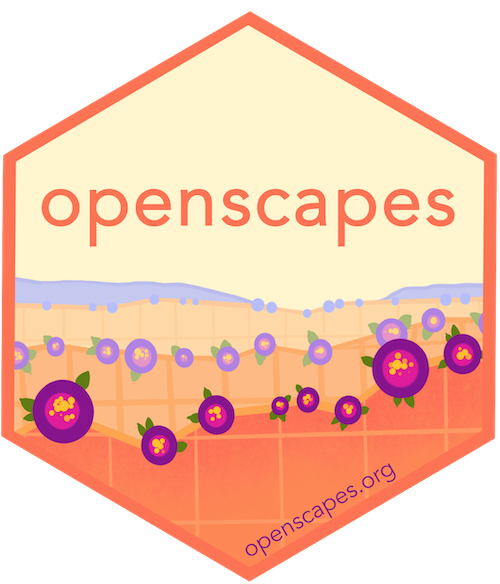{height="180px"}
:::

<h1 class="title">The NASA Earthdata Cloud Cookbook</h1>

A Quarto Collaboration Story

Andy Teucher, Openscapes

##

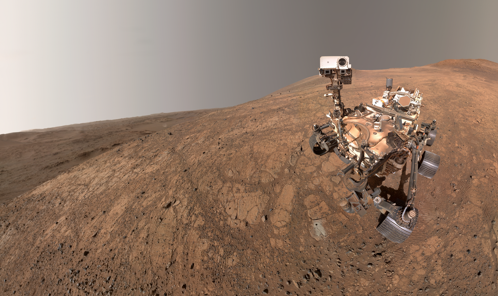{.absolute height=600px left=750px top=360px}

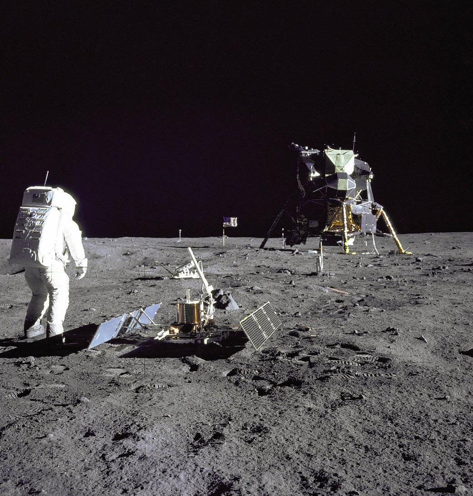{.absolute width=900px left=-120px top=-250px}

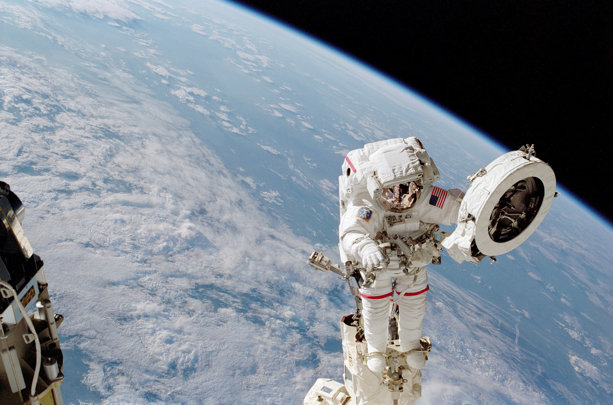{.absolute height=700px left=750px top=-240px}

{.absolute height=500px left=-270px top=450px}

{.absolute height=349.6px left=550px top=280px}

## {.center background-image="img/earth-from-space.png" data-menu-title="Earth from space"}

# 100+ petabytes of data

--------------------------------------------------------------------------------

::: daacs
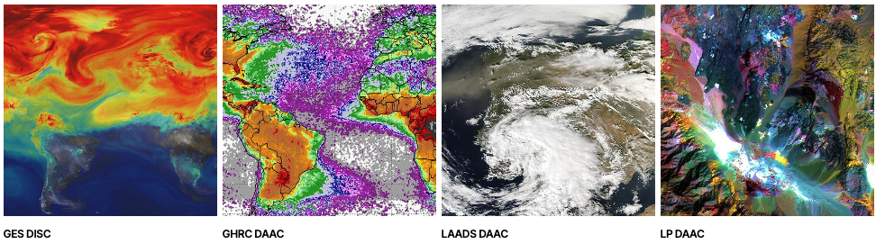{width="1100px"}

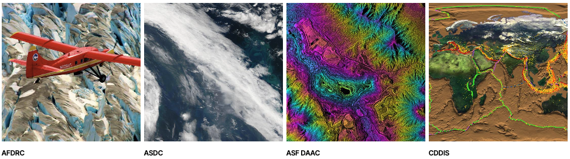{width="1100px"}

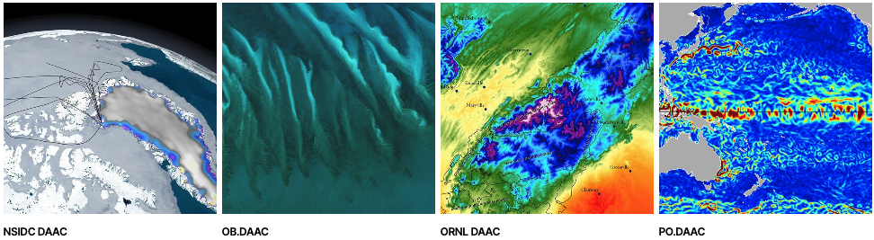{width="1100px"}
:::

## {.center background-image="img/mentors.png" data-menu-title="Mentors"}

## {.center background-image="img/openscapes.png" data-menu-title="Openscapes" background-size="contain"}

::: notes
- Don't work for NASA directly \- work with Openscapes, an organization that helps scientists do open, collaborative, and inclusive data-intensive science
:::

## Technical & Social Infrastructure Together with Policy

{.absolute height=220px left=1339px top=-36px}

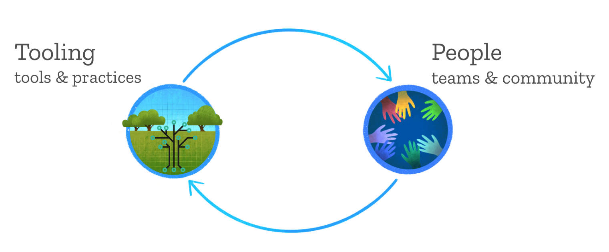{.absolute height=598px left=70px top=231.7px}

::: notes
- Provide structures for technical skill-building, efficient teamwork, and collaborative community development
- Openscapes image: tooling \+ people.
  These are not disparate things.
  Openscapes provides scaffolding and space and facilitation
:::

## NASA-Openscapes

::: columns
::::: {.column width="50%" .center-x}
{width="40%"} {width="30%"}

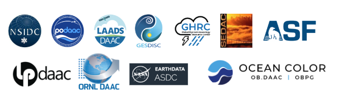
:::::

::::: {.column width="50%"}
### Mentor community across NASA Earth science data centers that helps support users through:

- Co-creating common tutorials
- Hosting cloud training events
- Practicing open science ourselves\!
- Open source code, communities, software development
:::::
:::

## DAACS creating tutorials (placeholder)

::: notes
- Data Center staff teach workshops on cloud data access, and from these produce amazing tutorials ...
- Reproducible tutorials are at the heart of teaching scientists modern data science workflows
- combining data access, code, and scientific context --- are a critical resource for users and for enabling NASA's cloud migration
- Data Centers were doing this in silos
  - duplicated effort
  - Not learning from each other
:::

## This may sound familiar...

::: fragment
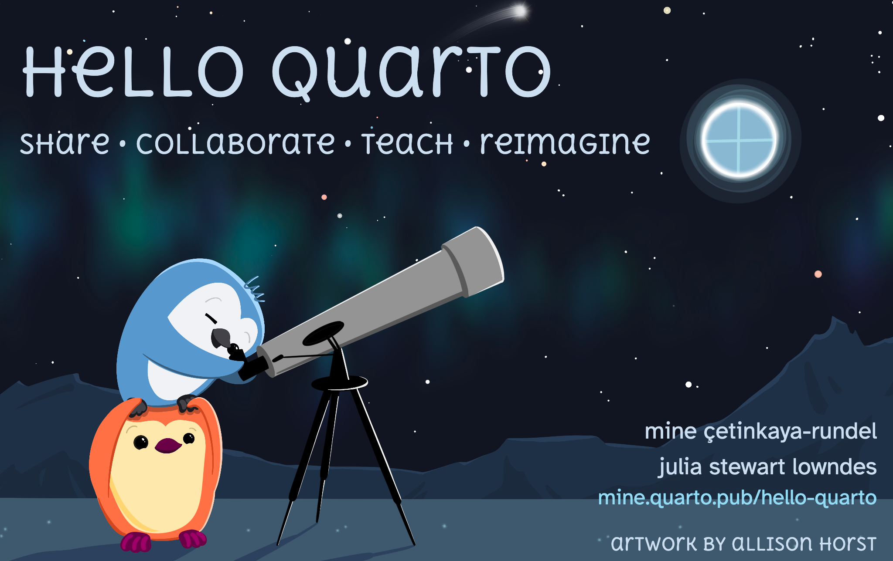{.absolute height=777px left=-83.6px top=130px style="border-radius: 20px;"}

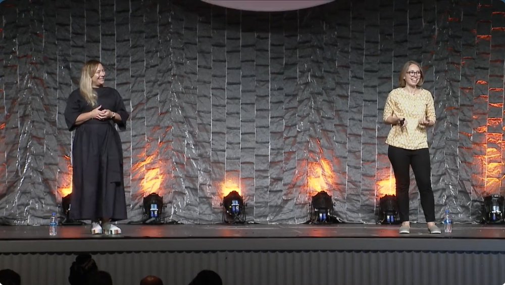{.absolute width=800px left=860px top=-19px style="border-radius: 20px;"}
:::

::: notes
Julie Lowndes - head of Openscapes - gave 2022 rstudio::conf keynote alongside Mine Çetinkaya-Rundel - introducing Quarto to the world.
In part because of work with RStudio and JJ Allaire where NASA Openscapes was a testing ground for developing Quarto while beginning development of the cookbook
:::

## The Earthdata Cloud Cookbook

::: columns
::::: {.column width="55%"}
- Built with Quarto
- Brings together documentation + Python and R tutorials
- Meets the needs of both **users** and **contributors**
- A growing, dynamic repository of tutorials & how-tos
:::::

::::: {.column width="5%"}
:::::

::::: {.column width="40%"}
{width="70%"}
:::::
:::

::: footer
<https://nasa-openscapes.github.io/earthdata-cloud-cookbook>
:::

::: notes
- Quarto as a multilingual publishing tool = scaffolding for a community
:::

## Earthdata Cloud Cookbook {.center}

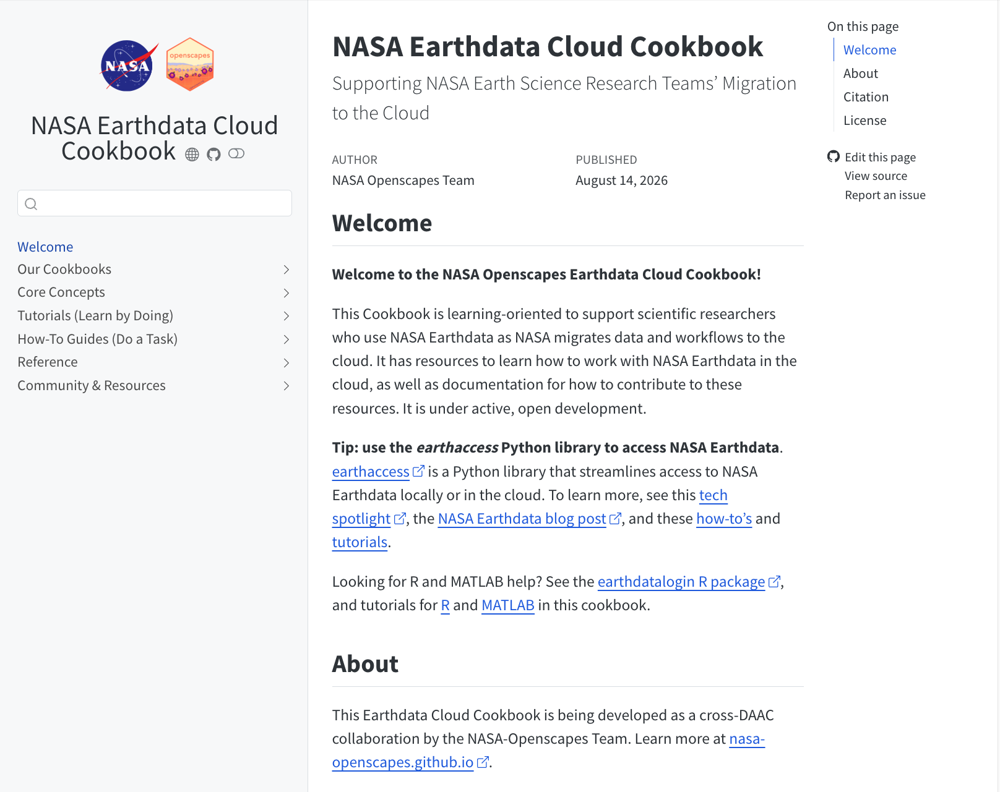

## Diataxis: a framework for documentation {.bg-color background-image="img/diataxis.png" background-size="contain"}

::: footer
<https://diataxis.fr>
:::

::: notes
Diátaxis divides documentation into four types: - tutorials, how-to guides, reference, and explanation --- based on two questions: is the user studying (learning) or working (doing), and is the content practical (action-oriented) or theoretical (knowledge)?
The key insight is that these modes have different and incompatible needs, so mixing them (e.g., teaching concepts inside a how-to) makes documentation worse for everyone; keeping them separate serves users best at each moment.
:::

## Constraints

::: incremental
- **Contributors** use R and Python
- **Users** use R and Python
- **Jupyter Notebooks** are cumbersome
- People **like** Jupyter Notebooks
- Contributors are **scientists**, not all are software engineers
:::

## Why Quarto?

::: incremental
- Multilingual
- Quarto file format
- Publishing tools
  - GitHub pages
  - Freeze
  - Multi-format download (ipynb)
:::

::: notes
- Multilingual \-
  - Meet contributors where they are and meet needs of diverse users
  - Contirbute via ipynb or qmd, Python or R
  - Standardized format look/feel
  - Why this is important \- specific examples from the cookbook that other people may be able to relate to.
- Quarto file format
  - Contributors seeing benefits over ipynb (slowly) \+1
  - Plain text file (?)
    easy to version control (difficult with ipynb)
- Publishing tools
  - GitHub pages
  - Freeze
    - Don't need to execute whole book
  - Multi-format download (ipynb) (people like notebooks)
    - Options to render to html-pdf-etc
:::

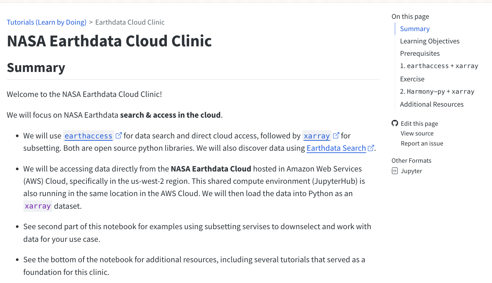
